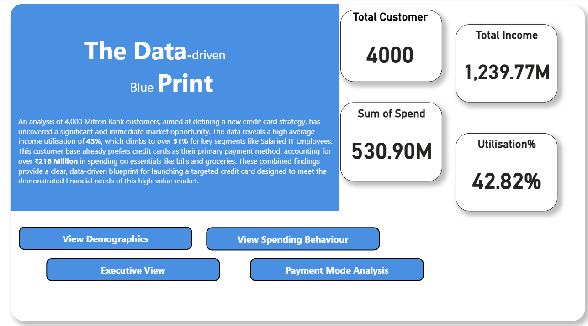
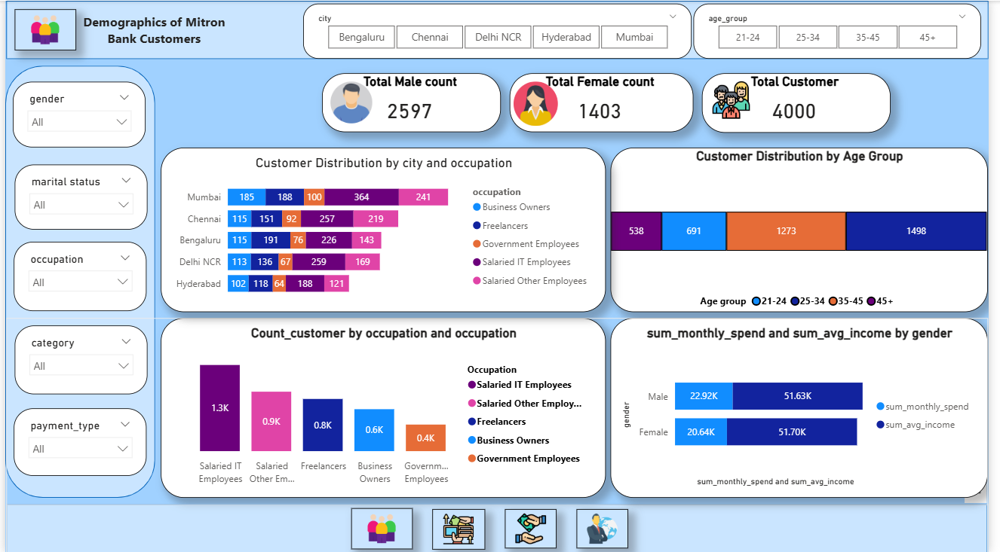
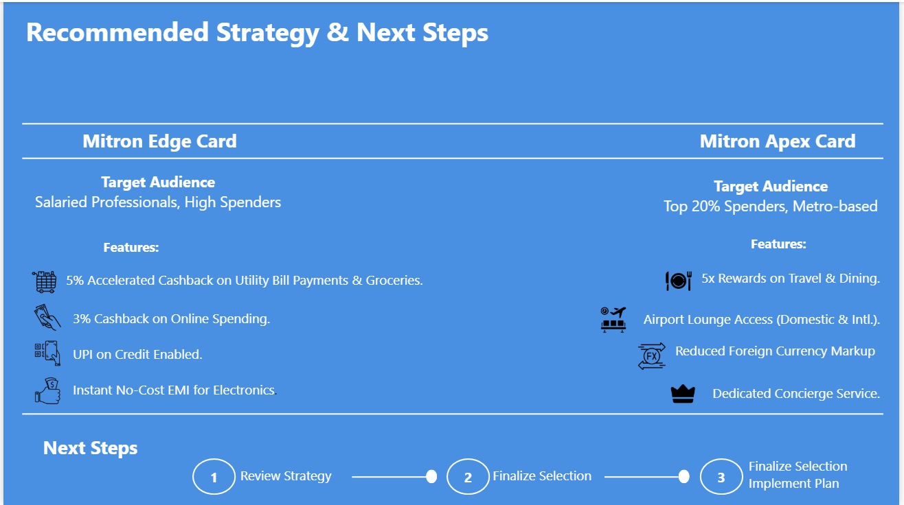

# Mitron Bank: A Data-Driven Credit Card Launch Strategy

## 📋 Project Overview
This project was undertaken to help Mitron Bank, a legacy financial institution, launch a new line of credit cards. I analyzed a sample dataset of 4,000 customers across five cities to uncover actionable insights. The goal was to move beyond data visualization to create a tangible, data-driven strategy that would inform the design, features, and marketing of the new credit cards.

---

## 🚀 Key Performance Indicators (KPIs)
| Metric | Value |
| :--- | :--- |
| **Customers Analyzed** | 4,000 |
| **Cities Covered** | 5 |
| **Recommended Card Strategies** | 2 |

---

## 🛠️ Tools Used

  
  
  

---

## 📊 Dashboard Walkthrough

### 1. Introduction: Setting the Scene
The project begins with a clear landing page that outlines the project's context, key objectives, and the main KPIs at a glance, providing an immediate understanding of the analysis.

  

### 2. Demographic Deep Dive
This view breaks down the customer base by key demographics such as age, gender, occupation, and city, providing a foundational understanding of who the potential cardholders are.

  

### 3. Analyzing Spending Behaviour
Here, the analysis focuses on *what* customers are spending on. By visualizing the top spending categories, we can identify key areas for targeted rewards and partnerships.

  

### 4. Understanding Payment Preferences
This slide analyzes *how* customers prefer to pay. It highlights the existing usage of credit cards and other payment methods, confirming the market's readiness for a new card offering.

  

### 5. The Executive Summary
This powerful one-page summary aggregates the most critical findings, analyzing income utilisation by occupation and city. This is the analytical engine that drives the final strategy.

  

### 6. The Final Recommendation: A Data-Driven Strategy
The final page presents the strategic recommendations derived from all the preceding analysis, detailing the proposed card types, their features, and the target audience for each.

  

---

## ✨ The Data-Driven Outcome
The core of this project was to translate deep data insights into a tangible business strategy. The final recommendation for a **two-card approach** is a direct result of the patterns uncovered during the analysis.

By analyzing spending habits and customer demographics, two distinct customer segments emerged: one driven by everyday essentials and another by lifestyle and travel spending. The proposed "Edge" and "Apex" cards are a **data-driven strategy tailored specifically to these segments**, ensuring that the new product line meets the demonstrated needs of the market and maximizes customer acquisition.

---

## 📂 Project Files
**[➡️ Download the full Power BI file (.pbix) here](./Dashboard%20file/Project_bank.pbix)**

---

## 🔗 Connect with Me
* **LinkedIn:** [Prathamesh Jumle](https://www.linkedin.com/in/prathamesh-jumle-1ba156208/)
